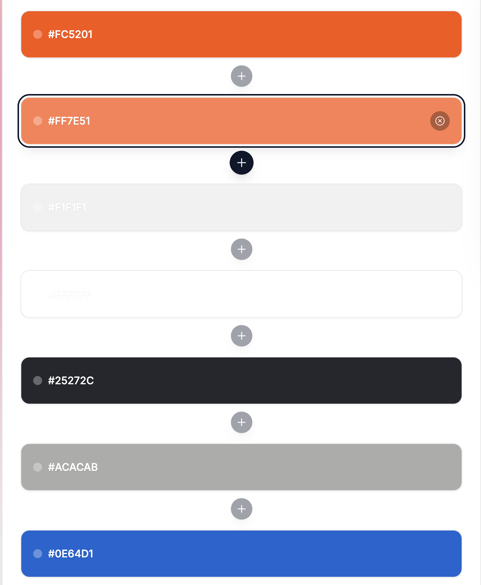

# Potentia | Maxima

Live Version: [Potentia | Maxima](https://potentia-7a9209d492dd.herokuapp.com)

Repository: [GitHub Repo](https://github.com/JarlathMacS/potentia_maxima)

The app is developed by [Jarlath Sweeney](https://github.com/JarlathMacS).

## About

[Potentia | Maxima](https://potentia-7a9209d492dd.herokuapp.com) is a coaching client communication application. The main goal of this app is to help the client users and the coaches interact with each other in a single, central location.  The aim is to increase the client base for the site owner, as well as bring efficiencies to the communications between the existing clients and their respective coaches.

## User Experience Design

### Strategy

Developed for busy clients and owners, the app is designed to be easy to use and intuitive. The goal of the app is to bring all communications between the parties to one central repository. This has been achieved with the use of a clean, simple, efficient, and sleek layout and design interface. 

### Target Audience

The app was developed for three different sets of users:
 
  * Site Visitors: to engage their interests, and to move them from being potential clients in to becoming client users.
  * Client Users: to simplify their coaching experience, and to bring value to their exercising lives.
  * Site Owners: to manage their clients coaching regimens efficienctly, and to boost numbers of client users.

### User Stories

#### Site Visitors Goals

| Issue ID    | User Story |
|-------------|-------------|
|[#1](https://github.com/JarlathMacS/potentia_maxima/issues/24)| | As a Site Visitor, I want to easily understand the main purpose of the site, so that I can learn more about the site | 
|[#2](https://github.com/JarlathMacS/potentia_maxima/issues/25)| | As a Site Visitor, I want to be able to easily navigate through the site, so that I can find the appropriate content | 
|[#3](https://github.com/JarlathMacS/potentia_maxima/issues/10)| | As a Site Visitor, I want to be able to read about the site | 
|[#4](https://github.com/JarlathMacS/potentia_maxima/issues/12)| | As a Site Visitor, I want to be able to fill in a contact form so that I can submit a request for a free consultation | 
|[#5](https://github.com/JarlathMacS/potentia_maxima/issues/6)| | As a Site Visitor, I want to be able to create an account, so that I can have my own personal Client User account | 

#### Client Users Goals

| Issue ID    | User Story |
|-------------|-------------|
|[#1](https://github.com/JarlathMacS/potentia_maxima/issues/28)| | As a Client User, I want to be able to find the site useful, so that I can benefit from it according to my individual needs |
|[#2](https://github.com/JarlathMacS/potentia_maxima/issues/34)|| As a Client User, I want to be able to easily navigate through the site, so that I can find the appropriate content | 
|[#3](https://github.com/JarlathMacS/potentia_maxima/issues/15)|| As a Client User, I want to be able to easily sign in to my created account, so that I can access my personal content | 
|[#4](https://github.com/JarlathMacS/potentia_maxima/issues/20)|| As a Client User, I want to be able to easily sign out of my account, so that I can secure my personal content | 
|[#5](https://github.com/JarlathMacS/potentia_maxima/issues/9)|| As a Client User, I want to be able to read a list of published coaching posts so that I can select which one I want to read in more detail | 
|[#6](https://github.com/JarlathMacS/potentia_maxima/issues/4)|| As a Client User, I want to be able to click on a single coaching post / title so that I can read its complete details | 
|[#7](https://github.com/JarlathMacS/potentia_maxima/issues/26)|| As a Client User, I want to be able to read progress comments on a coaching post so that I can read the feedback received and any tracking data previously submitted | 
|[#8](https://github.com/JarlathMacS/potentia_maxima/issues/16)|| As a Client User, I want to be able to reply to the Site Owner coaching posts, so that I can have a dialogue about my progress with my coach | 
|[#9](https://github.com/JarlathMacS/potentia_maxima/issues/7)|| As a Client User, I want to be able to update my progress comments on a coaching post so that I can accurately give feedback | 
|[#10](https://github.com/JarlathMacS/potentia_maxima/issues/29)|| As a Client User, I want to be able to delete my progress comments on a coaching post so that I can accurately give feedback | 

#### Site Owners Goals

| Issue ID    | User Story |
|-------------|-------------|
|[#1](https://github.com/JarlathMacS/potentia_maxima/issues/1)|| As a Site Owner, I want to be able to create draft coaching posts so that I can finish writing the content later | 
|[#2](https://github.com/JarlathMacS/potentia_maxima/issues/2)|| As a Site Owner, I want to be able to create coaching posts so that I can manage my coaching content | 
|[#3](https://github.com/JarlathMacS/potentia_maxima/issues/38)|| As a Site Owner, I want to be able to read a list of coaching posts (published or draft) so that I can select which one I want to read/update/delete in more detail | 
|[#4](https://github.com/JarlathMacS/potentia_maxima/issues/21)|| As a Site Owner, I want to be able to read coaching posts so that I can manage my coaching content | 
|[#5](https://github.com/JarlathMacS/potentia_maxima/issues/22)|| As a Site Owner, I want to be able to update coaching posts so that I can manage my coaching content | 
|[#6](https://github.com/JarlathMacS/potentia_maxima/issues/23)|| As a Site Owner, I want to be able to delete coaching posts so that I can manage my coaching content | 
|[#7](https://github.com/JarlathMacS/potentia_maxima/issues/19)|| As a Site Owner, I want to be able to reply to Client User progress comments on coaching posts so that I can dialogue with my Client Users | 
|[#8](https://github.com/JarlathMacS/potentia_maxima/issues/3)|| As a Site Owner, I want to be able to read progress comments on a coaching post so that I can read the Client User feedback and any tracking data submitted | 
|[#9](https://github.com/JarlathMacS/potentia_maxima/issues/32)|| As a Site Owner, I want to be able to update my progress comments on a coaching post so that I can accurately give feedback | 
|[#10](https://github.com/JarlathMacS/potentia_maxima/issues/30)|| As a Site Owner, I want to be able to delete my progress comments on a coaching post so that I can accurately give feedback | 
|[#11](https://github.com/JarlathMacS/potentia_maxima/issues/31)|| As a Site Owner, I want to be able to read about the site | 
|[#12](https://github.com/JarlathMacS/potentia_maxima/issues/11)|| As a Site Owner, I want to be able to create the About page content so that it is available on the site | 
|[#13](https://github.com/JarlathMacS/potentia_maxima/issues/17)|| As a Site Owner, I want to be able to update the About page content so that my information is kept current | 
|[#14](https://github.com/JarlathMacS/potentia_maxima/issues/27)|| As a Site Owner, I want to be able to delete About page content so that my information is kept current | 
|[#15](https://github.com/JarlathMacS/potentia_maxima/issues/13)|| As a Site Owner, I want to be able to store requests for free consultation in the database so that I can read them | 
|[#16](https://github.com/JarlathMacS/potentia_maxima/issues/14)|| As a Site Owner, I want to be able to mark requests for free consultation as "read" so that I can see how many I still need to action | 
|[#17](https://github.com/JarlathMacS/potentia_maxima/issues/33)|| As a Site Owner, I want to be able to delete requests for free consultation in the database so that I can manage them | 

---

## Technologies used

- ### Languages:
    
    + [Python 3.12.8](https://www.python.org/downloads/release/python-3128): the primary language used to develop the server-side of the website.
    + [JS](https://www.javascript.com): the primary language used to develop interactivity of forms.
    + [HTML](https://developer.mozilla.org/en-US/docs/Web/HTML): the markup language used to create the website.
    + [CSS](https://developer.mozilla.org/en-US/docs/Web/css): the styling language used to style the website.

- ### Frameworks and libraries:

    + [Django](https://www.djangoproject.com): python framework used to create all the logic.

- ### Databases:

    + [SQLite](https://www.sqlite.org): was used as a development and testing database.
    + [PostgreSQL](https://www.postgresql.org): the database used to store all the data.

- ### Other tools:

    + [Git](https://git-scm.com): the version control system used to manage the code.
    + [Pip3](https://pypi.org/project/pip): the package manager used to install the dependencies.
    + [Gunicorn](https://gunicorn.org): the webserver used to run the website.
    + [Django-allauth](https://django-allauth.readthedocs.io/en/latest): the authentication library used to create the user accounts.
    + [Django-crispy-forms](https://django-cryptography.readthedocs.io/en/latest): was used to control the rendering behavior of Django forms.
    + [GitHub](https://github.com): used to host the website's source code.
    + [VSCode](https://code.visualstudio.com): the IDE used to develop the website.
    + [Chrome DevTools](https://developer.chrome.com/docs/devtools/open): was used to debug the website.
    + [Font Awesome](https://fontawesome.com): was used to create the icons used in the website.
    + [Balsamiq](https://balsamiq.cloud) was used for wireframes.
    + [Image Color Picker](https://imagecolorpicker.com) was used to make a color palette for the website.
    + [W3C Validator](https://validator.w3.org): was used to validate HTML5 code for the website.
    + [W3C CSS validator](https://jigsaw.w3.org/css-validator): was used to validate CSS code for the website.
    + [JShint](https://jshint.com): was used to validate JS code for the website.
    + [CI Python Linter](https://pep8ci.herokuapp.com): was used to validate Python code for the website.

---

## FEATURES

Please refer to the [FEATURES.md](FEATURES.md) file for all features-related documentation.

---

## Design

The design of the application is based on a clean, uncluttered idea.  The central theme of the application is the simplicity of use. Thus, all the components are designed to be easy to use.  An abundence of white and white spaces was decided upon in order to create a more pleasant user experience. 

### Color Scheme

The color scheme of the application is based on the colors:

### Wireframes

- [Wireframes](documentation/wireframes/pp4_desktop.pdf)

---

---

## Information Architecture

### Database

* During the earliest stages of the project, the database was created using SQLite.
* The database was then migrated to PostgreSQL.

### Entity-Relationship Diagram

* The initial ERD was created using [Lucid Chart](https://lucid.app).

- [Database Schema](documentation/database/erd.pdf)

---
## Testing

Please refer to the [TESTING.md](TESTING.md) file for all test-related documentation.

---

## Deployment

- The app is deployed to [Heroku](https://heroku.com)
- The database is [PostgreSQL](https://www.postgresql.org) hosted by [Code Institute](https://dbs.ci-dbs.net/manage)
- The app can be accessed by this [link](https://potentia-7a9209d492dd.herokuapp.com)

Please refer to the [DEPLOYMENT.md](DEPLOYMENT.md) file for all deployment-related documentation.

---

## Credits

- [GitHub](https://github.com) for giving the idea of the project's design.
- [Django](https://www.djangoproject.com) for the framework.
- [Font awesome](https://fontawesome.com): for the free access to icons.
- [Heroku](https://www.heroku.com): for the free hosting of the website.
- [Postgresql](https://www.postgresql.org): for providing a free database.
- [Responsive Viewer](https://chrome.google.com/webstore/detail/responsive-viewer/inmopeiepgfljkpkidclfgbgbmfcennb/related?hl=en): for providing a free platform to test website responsiveness
- [Favicon Generator](https://realfavicongenerator.net): for providing a free platform to generate favicons.
- [NVDM Coaching](https://www.nvdmcoaching.com) for some coaching content
- [Training Peaks](https://www.trainingpeaks.com) for some coaching content
- [Strava](https://www.strava.com) for some coaching content, and website inspiration

*All comments have been anonymised - client names are fictional*

---

## Acknowledgments

- [Iuliia Konovalova](https://github.com/IuliiaKonovalova), my mentor, for her knowledge, advice, and wisdom
- [Fiachra Mac Suibhne](https://www.instagram.com/actacoaching), my nephew, whose endeavors inspired this project

---
---

[Back to top](#potentia--maxima)

---

