# Potentia | Maxima

## Testing

---
### Manual Testing

Testing was done during development, for each feature, before it was 
integrated in to the project.  Usability was tested with the below user 
acceptance testing.

|     | User Actions           | Expected Results | Y/N | Comments    |
|-------------|------------------------|------------------|------|-------------|
| Navbar      |                        |                  |      |             |
| 1           | Click on logo | Navigate to home page | Y |          |
| 2           | Click on home menu item | Navigate to home page | Y |          |
| 3           | Click on about menu item | Navigate to about page | Y |          |
| 4           | Click on enquire menu item | Navigate to enquire page | Y |          |
| 5           | Click on sign up menu item | Navigate to sign up page | Y |          |
| 6           | Click on log in menu item | Navigate to log in page | Y |          |
| 7           | Click on log out menu item | Navigate to log out page to confirm log out | Y |          |
| Footer      |                        |                  |      |             |
| 1           | Click on logo | Navigate to home page | Y |          |
| 2           | Click on Instagram icon | Open new tab for instagram.com | Y |          |
| 3           | Click on GitHub icon | Open new tab for developer on github.com | Y |          |
| 4           | Click on LinkedIn icon | Open new tab for developer on linkedin.com | Y |          |
| Landing Home Page    |                        |                  |      |             |
| 1           | Click on the sign up button | Navigate to sign up page | Y | access by all visitors         |
| 2           | Click on log in button | Navigate to log in page | Y | access by all visitors         |
| Sign Up     |                        |                  |      |             |
| 1           | Click on log in link | Navigate to log in page | Y | access by all visitors         |
| 2           | Enter valid username | Field will only accept no more than 150 characters | Y | access by all visitors         |
| 3           | Enter valid email | Field will only accept valid email address format | Y | access by all visitors         |
| 4          | Enter valid password | Field will only accept valid passwords | Y | access by all visitors         |
| 5          | Enter valid password again | Field will only accept same password from above field | Y | access by all visitors         |
| 6          | Click on sign up action button | Navigate to client home page | Y | access by all visitors         |
| Log In     |                        |                  |      |             |
| 1           | Click on the sign up link | Navigate to sign up page | Y | access by all visitors         |
| 2           | Enter valid username | Field will only accept no more than 150 characters | Y | access by all visitors         |
| 3           | Enter valid password | Field will only accept valid passwords | Y | access by all visitors         |
| 4           | Click on the log in action button | Navigate to client home page | Y | access by all visitors         |
| Log Out     |                        |                  |      |             |
| 1           | Click on log out action button | Navigate to landing home page | Y | access only by logged in client users |
| Client Home Page    |                        |                  |      |             |
| 1           | Click on excerpt | Navigate to detail page | Y | access only by logged in client users |
| 2           | Click on next button | Navigate to next page | Y | access only by logged in client users |
| 3           | Click on prev button | Navigate to previous page | Y | access only by logged in client users |
| Coaching Post Detail Page    |                        |                  |      |             |
| 1           | Create a comment | Read confirmation message | Y | access only by logged in client users |
| 2           | Update a comment | Read confirmation message | Y | access only by logged in client users |
| 3           | Delete a comment | Read confirmation message | Y | access only by logged in client users |
| About Page    |                        |                  |      |             |
| 1           | Read about page | Read about page | Y | access by all visitors |
| Enquire Page    |                        |                  |      |             |
| 1           | Enter valid name | Field will only accept no more than 200 characters | Y | access by all visitors         |
| 2           | Enter valid email | Field will only accept valid email address format | Y | access by all visitors         |
| 3          | Click on submit action button | Read confirmation message | Y | access by all visitors         |
| 404 Error Page    |                        |                  |      |             |
| 1          | Click on home button | Navigate to landing home page | Y | access by all visitors         |
| 2          | Click on home button | Navigate to client home page | Y | access only by logged in client users         |
| 3          | Click on log in button | Navigate to log in page | Y | access by all visitors         |
| 500 Error Page    |                        |                  |      |             |
| 1          | Click on home button | Navigate to client home page | Y | access only by logged in client users         |

---
### Testing User Story

| Site Visitor Goals | Requirement met |
| ------------------------- | --------------- |
| As a Site Visitor, I want to easily understand the main purpose of the site, so that I can learn more about the site | The very first engagement a visitor has with the site is a collage of inspiring hero images of the coach at exercise.  In particular the About page clearly explains the aim and potential of the site |
| As a Site Visitor, I want to be able to easily navigate through the site, so that I can find the appropriate content | The navigation links are easy to use and accurate | 
| As a Site Visitor, I want to be able to read about the site | When the About link is clicked, the about text is visible |
| As a Site Visitor, I want to be able to fill in a contact form so that I can submit a request for a free consultation | Given a site visitor, they can successfully submit a request for a free consultation |
| As a Site Visitor, I want to be able to create an account, so that I can have my own personal Client User account | Given a username and password, a Site Visitor can create a Client User account |

| Client User Goals | Requirement met |
| ------------------------- | --------------- |
| As a Client User, I want to be able to find the site useful, so that I can benefit from it according to my individual needs | As a Client User, the site meets my needs for individualised coaching and performance feedback |
| As a Client User, I want to be able to easily navigate through the site, so that I can find the appropriate content | As a Client User, the navigation links are easy to use and accurate |
| As a Client User, I want to be able to easily sign in to my created account, so that I can access my personal content | The Client User can sign in successfully to the created account |
| As a Client User, I want to be able to easily sign out of my account, so that I can secure my personal content | The logged-in Client User can sign out successfully |
| As a Client User, I want to be able to read a list of published coaching posts so that I can select which one I want to read in more detail | Given a Logged In Client User, and given one or more coaching posts in the database, the Client User home page is a paginated list of unique coaching posts for which they are the client / audience.  The Logged In Client User sees all the coaching posts / titles with pagination in order to choose what to read |
| As a Client User, I want to be able to click on a single coaching post / title so that I can read its complete details | When a single coaching post / title is clicked on, its details becomes viewable for reading |
| As a Client User, I want to be able to read progress comments on a coaching post so that I can read the feedback received and any tracking data previously submitted | Given one or more progress comments, the logged in Client User can read all progress comments under the coaching posts intended for them |
| As a Client User, I want to be able to reply to the Site Owner coaching posts, so that I can have a dialogue about my progress with my coach | Given a logged in Client User, they can create progress comments under a coaching post |
| As a Client User, I want to be able to update my progress comments on a coaching post so that I can accurately give feedback | Given a logged in Client User, they can update their progress comments |
| As a Client User, I want to be able to delete my progress comments on a coaching post so that I can accurately give feedback | Given a logged in Client User, they can delete their progress comments |

| Site Owner Goals | Requirement met |
| ------------------------- | --------------- |
| As a Site Owner, I want to be able to create draft coaching posts so that I can finish writing the content later | Given a logged in Site Owner, they can save a draft coaching post, which they can finish the content at a later time |
| As a Site Owner, I want to be able to create coaching posts so that I can manage my coaching content | Given a logged in Site Owner, they can create a coaching post |
| As a Site Owner, I want to be able to read a list of coaching posts (published or draft) so that I can select which one I want to read/update/delete in more detail | The Logged In Site Owner sees all the coaching posts on the admin page in order to choose what to read/update/delete |
| As a Site Owner, I want to be able to read coaching posts so that I can manage my coaching content | Given a logged in Site Owner, they can read a coaching post |
| As a Site Owner, I want to be able to update coaching posts so that I can manage my coaching content | Given a logged in Site Owner, they can update a coaching post |
| As a Site Owner, I want to be able to delete coaching posts so that I can manage my coaching content | Given a logged in Site Owner, they can delete a coaching post |
| As a Site Owner, I want to be able to reply to Client User progress comments on coaching posts so that I can dialogue with my Client Users | Given a logged in Site Owner, they can create comment replies to a Client User progress comment |
| As a Site Owner, I want to be able to read progress comments on a coaching post so that I can read the Client User feedback and any tracking data submitted | Given one or more progress comments, the logged in Site Owner can read all the progress comments submitted |
| As a Site Owner, I want to be able to update my progress comments on a coaching post so that I can accurately give feedback | Given a logged in Site Owner, they can update their progress comments |
| As a Site Owner, I want to be able to delete my progress comments on a coaching post so that I can accurately give feedback | Given a logged in Site Owner, they can delete their progress comments |
| As a Site Owner, I want to be able to read about the site | When the About link is clicked, the about text is visible |
| As a Site Owner, I want to be able to create the About page content so that it is available on the site | The About app is visible in the admin panel |
| As a Site Owner, I want to be able to update the About page content so that my information is kept current | The About app is up to date in the admin panel |
| As a Site Owner, I want to be able to delete About page content so that my information is kept current | The About app is up to date in the admin panel |
| As a Site Owner, I want to be able to store requests for free consultation in the database so that I can read them | Given one or more requests for free consultation, the Site Owner can read them |
| As a Site Owner, I want to be able to mark requests for free consultation as "read" so that I can see how many I still need to action | Given one or more requests for free consultation, the Site Owner can mark them as "read" |
| As a Site Owner, I want to be able to delete requests for free consultation in the database so that I can manage them | Given one or more requests for free consultation, the Site Owner can delete them |

---
### Bugs

When testing responsiveness, I received a 403 forbidden error when updating a progress comment:

[403 Error](documentation/bugs/403.png)

I realised that the reason was that I was testing responsiveness simultaneously on multiple screens/devices using the [Responsive Viewer](https://chrome.google.com/webstore/detail/responsive-viewer/inmopeiepgfljkpkidclfgbgbmfcennb/related?hl=en) Chrome extension.  This was causing the CSRF token to be reused multiple times, which of course it can not.  I solved this issue by only testing on a single screen at a time.

---
### Validation

#### HTML Validation:

- [Index HTML Validation Report](documentation/validation/html/index.pdf)
- [Detail HTML Validation Report](documentation/validation/html/detail.pdf)
- [About HTML Validation Report](documentation/validation/html/about.pdf)
- [Enquire HTML Validation Report](documentation/validation/html/enquire.pdf)
- [404 HTML Validation Report](documentation/validation/html/404.pdf)
- [500 HTML Validation Report](documentation/validation/html/500.pdf)

- No errors or warnings were found when passing through the official [W3C](https://validator.w3.org) validator. 
This checking was done manually by copying the page source code and pasting it into the validator.

#### CSS Validation:

- [CSS Validation Report](documentation/validation/css/css.pdf)

- No errors were found when passing through the official [W3C (Jigsaw)](https://jigsaw.w3.org/css-validator) validator.
Two warnings about the use of vendor extensions were returned.

#### JS Validation:

- [JS Validation Report](documentation/validation/js/js.pdf)

- No errors or warning messages were found when passing through the [JSHint](https://www.jshint.com) validator.

#### Python Validation:

- [Potentia Python Validation Report](documentation/validation/python/potentia/potentia.pdf)
- [About Python Validation Report](documentation/validation/python/about/about.pdf)
- [Enquire Python Validation Report](documentation/validation/python/enquire/enquire.pdf)
- [Home Python Validation Report](documentation/validation/python/home/home.pdf)

- No errors were found when the code was passed through Code Institute's [python linter](https://pep8ci.herokuapp.com).

---
### Lighthouse Reports
---
#### Landing Home Page

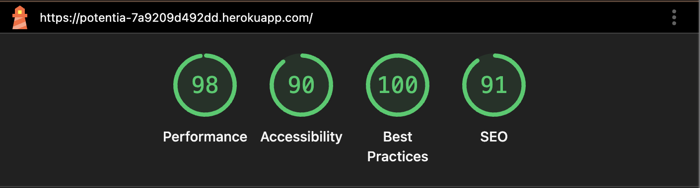

#### Sign Up Page

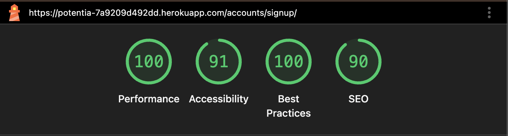

#### Log In Page

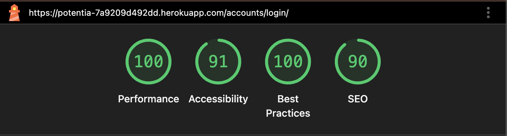

#### Log Out Page

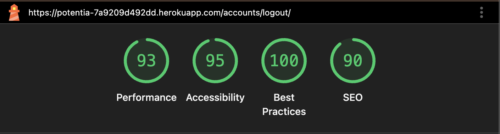

#### Client Home Page - 1

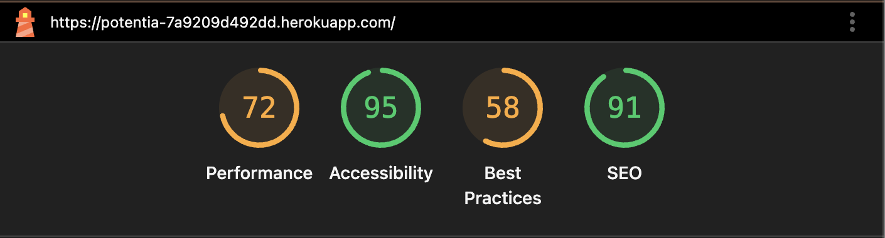

#### Client Home Page - 2

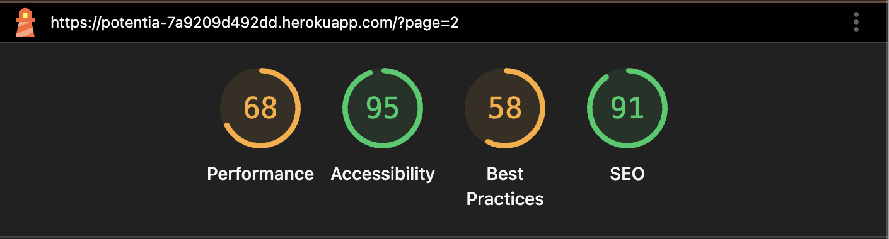

#### Client Home Page - 3

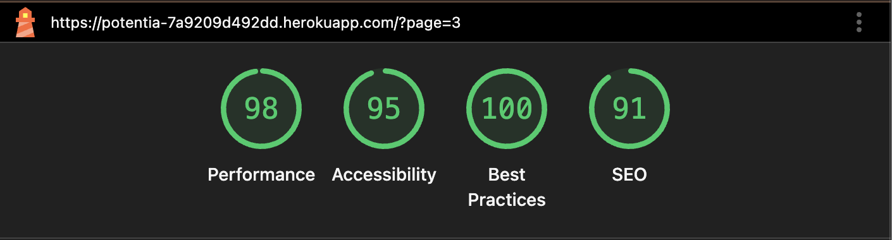

#### Detail Page - 1

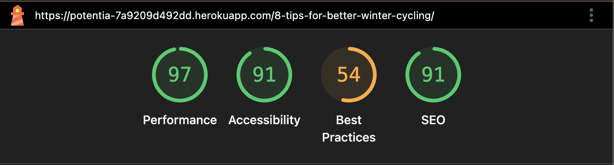

#### Detail Page - 2

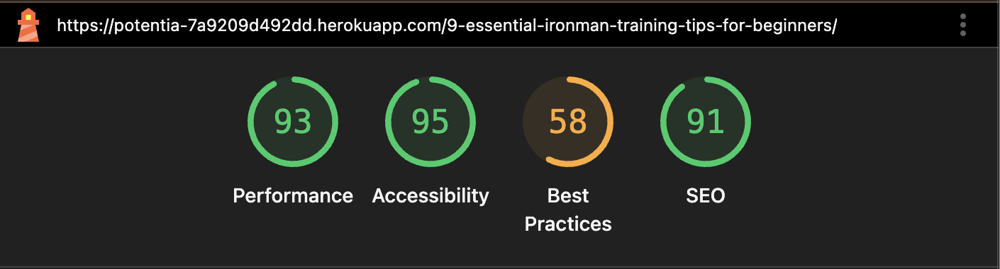

#### Detail Page - 3

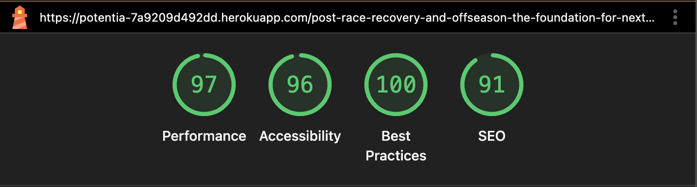

#### About Page

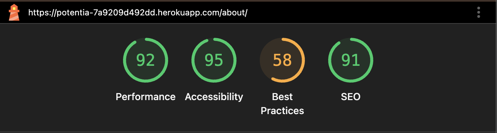

#### Enquire Page

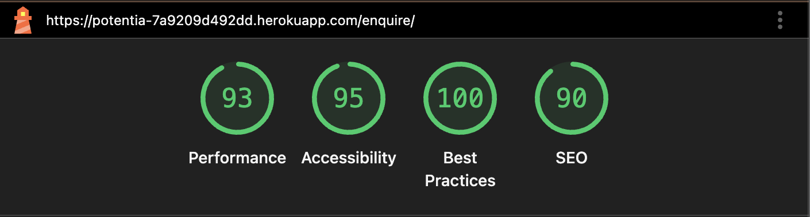

#### 404 Page

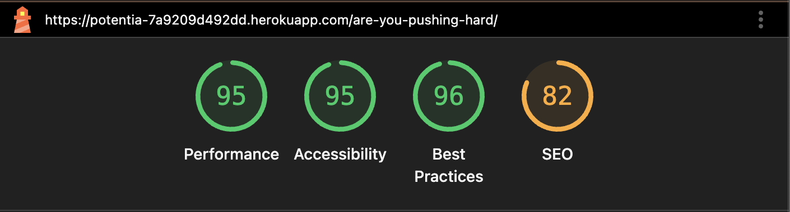

#### Error-Log In Page

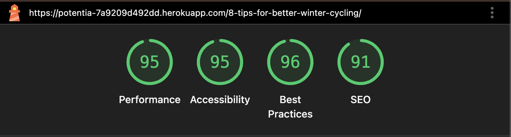

---

### Compatibility

Testing was conducted on the following browsers:

- Safari
- Chrome

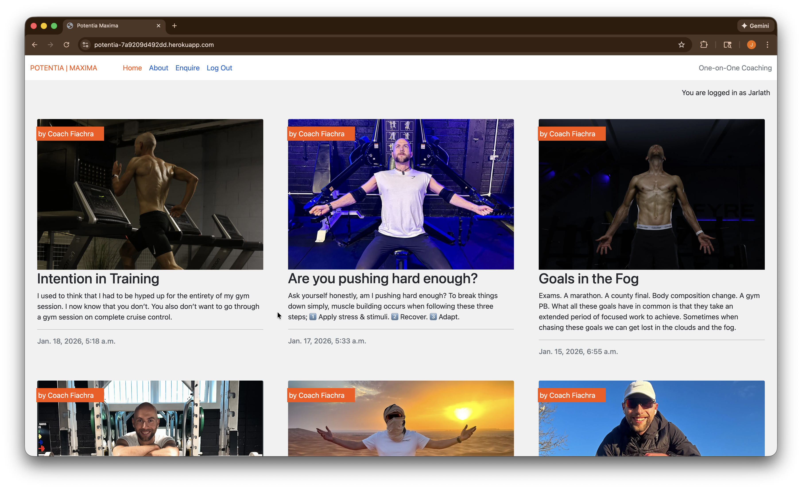

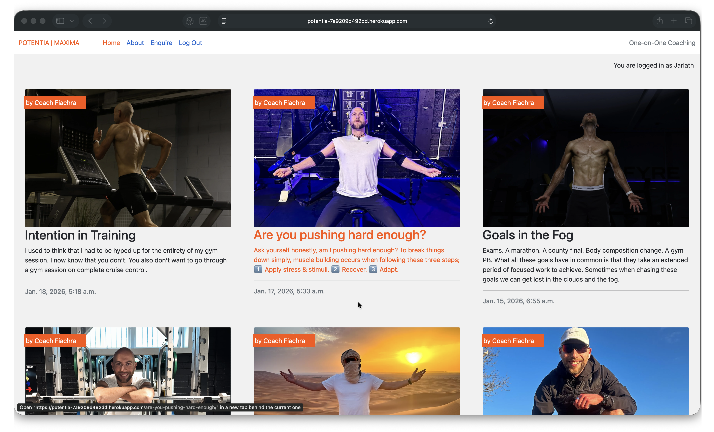

---

### Responsiveness

The responsiveness was checked manually by using devtools (Chrome) throughout the development. 
It was also checked with [Responsive Viewer](https://chrome.google.com/webstore/detail/responsive-viewer/inmopeiepgfljkpkidclfgbgbmfcennb/related?hl=en) Chrome extension.

[Responsiveness Report](documentation/responsive/responsive.pdf)

---

[Back to top](#potentia--maxima)

---

